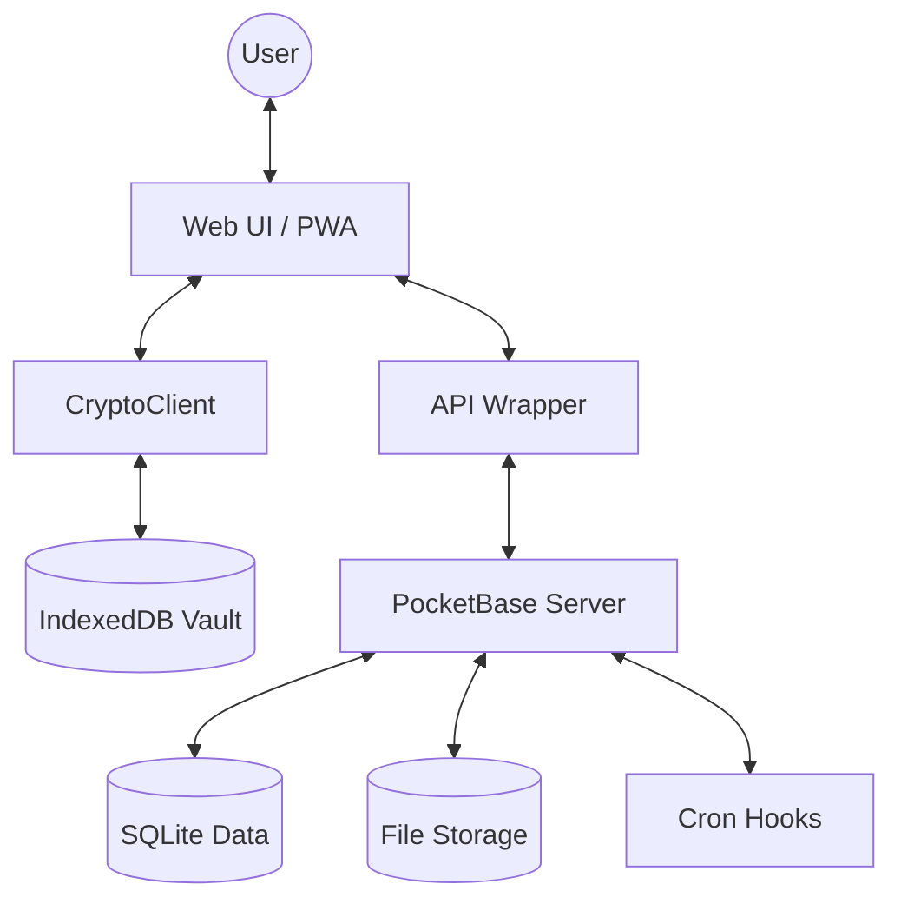

# Architecture: CryptMessenger (Fortress Edition)

## 1. Global Overview
CryptMessenger is a PWA (Progressive Web App) designed with a **Zero-Knowledge** philosophy. The core principle is that the server acts only as a blind relay and persistent storage for encrypted blobs, while all logic, key management, and cryptographic operations occur exclusively on the client side.

### 1.1. Technology Stack
- **Frontend**: Vanilla JavaScript (ES6+), CSS3 (Modern Variables & Flexbox/Grid), HTML5.
- **Backend**: PocketBase (Go-based) for primary storage, Real-time APIs, and Auth.
- **Crypto**: `libsodium` (via `sodium-universal` / `window.sodium`).
- **Real-time**: Socket.io (optional/hybrid) or PocketBase Realtime (SSE).
- **Storage**: IndexedDB for the local "Vault".

---

## 2. Component Interaction

### 2.1. Frontend Modules
- **CryptoClient**: The "Heart". Manages keys, ratchets, encryption, and decryption.
- **API**: Wrapper for PocketBase and custom endpoints. Handles authentication and data fetching.
- **Chat/Messages**: UI Controllers that manage the chat list, message rendering, and user interactions.
- **App**: Main orchestrator that initializes the system and manages global state.

### 2.2. Backend Services
- **PocketBase**:
    - **Database**: Collections for `users`, `conversations`, and `messages`.
    - **Auth**: Secure JWT-based authentication.
    - **Storage**: S3-compatible or local storage for encrypted media.
    - **Hooks**: Server-side logic (Go/JS) for automated cleanup.
- **Socket.io (Optional Layer)**: Used for instant presence updates and typing indicators if SSE is insufficient.

---

## 3. Data Flow

### 3.1. Message Sending Flow
1. **Plaintext Input**: User types a message.
2. **Ratchet Step**: `CryptoClient` derives a new `Message Key` from the `Chain Key`.
3. **Encryption**: Message is encrypted using `XChaCha20-Poly1305`.
4. **Vault Update**: The new `Chain Key` and message index are saved to IndexedDB.
5. **API Upload**: The encrypted blob, nonce, and counter are sent to PocketBase.
6. **Relay**: PocketBase notifies the recipient via SSE/WebSockets.

### 3.2. Message Receiving Flow
1. **Notification**: Recipient receives an encrypted message object.
2. **Vault Retrieval**: `CryptoClient` fetches the session state for the conversation from IndexedDB.
3. **Key Derivation**: Based on the message `counter`, the correct key is retrieved or derived.
4. **Decryption**: Blob is decrypted in memory.
5. **Rendering**: Plaintext is rendered in the UI. **Note**: Plaintext is never saved to the database.

---

## 4. Logical Components Diagram

---

## 5. Scalability & Resilience
- **Offline-First**: IndexedDB allows reading message history and session states without an internet connection.
- **Stateless Backend**: The server doesn't need to know anything about the encryption, making it easily replaceable or horizontal-scalable.
- **Media Optimization**: Files are chunked and encrypted before upload, ensuring that even large files don't leak metadata.
